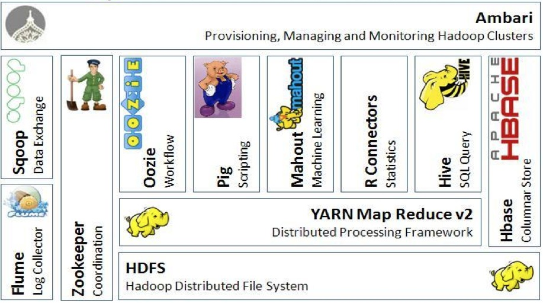

## Engenharia de Dados

Este repositório contém notas de aulas realizadas em: 
* Bootcamp Engenheiro de Dados - IGTI;
* Aceleração Digital Innovation One (DIO) ministrada pela Everis
* Big Data Foundations - Semantix 

#### Ecossistema Apache

- Ambari: ferramenta para gerenciamento e monitoramento do cluster (Consumo de CPU, memória e rede)
- Zookeeper: corrdenador de serviços distribuidos. Coordena locks, sincronização e grupos de serviços de maneira distribuídas.
- Flume: coletor de logs;
- Sqoop: transferência de dados;
- Pig: script;
- Hive: data warehouse;
- Hbase: banco de dados não-relacional, distribuído e orientado a colunas;
- Yarn: framework para distribuição de tarefas. Gerenciamento dos recursos do cluster
- Oozie: agendamento de tarefas hadoop.

Para conhecer mais sobre as tecnologias:

1. [Hadoop](hadoop/readme.md)
2. [Hbase](hbase/readme.md)
3. [Hive](hive/readme.md)
4. [Sqoop](spark/readme.md)
5. [Spark](spark/readme.md)

Guia de instalação: [Instalação](instalacao.md)

