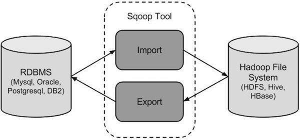

## Sqoop

Ferramenta para transferir dados entre o Hadoop e banco de dados relacionais ou mainframes

<center> Sqoop = <u>SQ</u>L to Had<u>oop</u> </center>

<br>

[](https://bigdatagear.wordpress.com/learning/)

#### Principais caracterísitcas 
- Permite a importação de banco de dados externos.
- Paraleliza a transferência de dados para melhorar performance e otimizar a utilização do sistema
- Copia dados repidamente de fontes externas para o Hadoop

#### Comandos

- help
- version
- import
- import-all-tables
- export
- validation
- job
- metastore
- merge
- codegen
- create-hive-table
- eval
- list-databases
- list-tables

##### Informações para conexão

```bash
sqoop \
--connect <connection> \
--username <user> \
--password <pass> \
```

##### Listar banco de dados

```bash
sqoop list-databases \
--connect <connection> \
--username <user> \
--password <pass> \
```

##### Listar tabelas

```bash
sqoop list-tables \
--connect <connection> \
--username <user> \
--password <pass> \
```


##### Verifica a versão

```bash
sqoop version
```

##### Ajuda de um comando

```bash
sqoop help import
```

##### Consultar tabelas

```bash
sqoop eval \
--connect jdbc:mysql://database/employees \
--username <user> \
--password <pass> \
--query "SELECT * FROM employees LIMIT 10"
```

##### Criar tabela

```bash
sqoop eval \
--connect jdbc:mysql://database/employees \
--username <user> \
--password <pass> \
--query "CREATE TABLE setor(cod int, name varchar(30))"
```

##### Inserir linhas na tabela

```bash
sqoop eval \
--connect jdbc:mysql://database/employees \
--username <user> \
--password <pass> \
--query "INSERT INTO setor VALUES(1, 'vendas)"
```

##### Importar dados de um RDBMS

```bash
sqoop import --table employees \
--connect jdbc:mysql://database/employees \
--username <user> \
--password <pass> \
--columns "id, last_name" \
--where "state='SP'"
```

##### Armazenar em diretório diferente 

Por padrão, o sqoop armazena os dados no diretório home do HDFS.

Ex. /user/<nome_usuario>/<nome_tabela>

--target-dir: Armazena em um diretório específico

```bash
sqoop import ... --target-dir /user/root/db
```

--warehouse-dir: Armazena em um diretório base

```bash
sqoop import ... --warehouse-dir /user/root/db
```

Ex. Importar tabela departments

--target-dir /data = /data

--warehouse-dir /data = /data/departments

##### Subrescrever o diretório

```bash
sqoop import ... --warehouse-dir /user/cloudera/db -delete-target-dir
```

##### Anexar os dados no diretório existente

```bash
sqoop import ... --warehouse-dir /user/cloudera/db -append
```

##### Delimitadores

Por padrão, o sqoop gera arquivos de textos 
- Campos delimitados por vírgula
- Linhas terminadas por quebra de linha \n

Comandos:

```bash
--fields-terminated-by <delimitador>
--lines-terminated-by <delimitador>
```

##### Mapeadores

- Por padrão, o número de mapeadores é 4
- -m, ou --num-mappers: Quantidade de mapeadores
- Divisão aplicada a coluna com chave primária

    - Se existir 
        
        - -num-mappers 8

    - Se não existir

        - -num-mappers 1
        - --auto-reset-to-one-mapper

            - Manipular tabelas automáticamente
        
        - -num-mappers > 1 = erro

            - Solução split
- Divisão Colunas não chave

    - --split-by: Dividir mapeadores em uma coluna sem chave

    ```bash
    sqoop import ... --split-by: id
    ```
    - Valores nulos na coluna: Registros correspondentes da tabela serão ignorados
    - Dados na coluna de divisão não precisam ser exclusivos: Pode haver uma distorção nos dados durante a importação.

##### Valores Nulos

- Por padrão o sqoop importa os dados null como string null

    - Valor escrito para um campo nulo de número

        - --null-non-string <valor nulo>
        ```bash
        sqoop import ... --null-non-string '-1'
        ```

    - Valor escrito para um campo nulo de string

        - --null-string <valor nulo>
        ```bash
        sqoop import ... --null-string 'NA'
        ```
##### Formato Dados

Por padrão o Sqoop armazena os dados no formato de arquivo de texto

- Default

```bash
sqoop import ... --as-textfile
```

- Parquet

```bash
sqoop import ... --as-parquetfile
```

- Avro

```bash
sqoop import ... --as-avrodatafile
```

Sequência

```bash
sqoop import ... --as-sequencefile
```

##### Compressão Dados

Por padrão, o sqoop comprimi os dados por gzip

- gzip - org.apache.hadoop.ip.compress.GzipCodec
- bzip2 - org.apache.hadoop.io.compress.BZip2Codec
- snappy - org.apache.hadoop.io.compress.SnappyCode
- outros

```bash
sqoop import ... --compress --compression-codec org.apache.hadoop.io.compress.SnappyCode
```

##### Carga incremental - Append

- Anexar os dados em conjunto de dados existentes no HDFS

    - Anexar todos os dados

    ```bash
    sqoop import ... --append --where 'id_venda > 10'
    ```

    - Anexar apenas os novos dados (incremental). Sem sobrescrever os dados, em relação à uma coluna e um valor exclusivo crescente

    ```bash
    sqoop import ... --incremental append --check-column id_venda --last-value 50
    ```

##### Carga incremental - Lastmodified

- Anexar os dados em conjunto de dados existentes no HDFS

    - Sobrescrever os dados, em relação à uma coluna e um valor de data e hora

    ```bash
    sqoop import ... --incremental lastmodified --merge-key data_id --check-column data_venda --last-value '2021-01-18'
    ```

##### Importar dados no Hive

Caminhão padrão das tabelas Hive

- /user/hive/warehouse/

Bom desempenho: Formato parquet e compressão snappy

--map-column-hive: Mapeamento para hive

```bash
sqoop import ... --map-column-hive id=String, value=Integer
```

Importação Tabela Hive

- --hive-import: Importar tabela para o hive
- --hive-overwrite: Sobrescrever os addos se a tabela hive existir
- --create-hive-table: O job irá falhar se uma tabela hive existir
- --hive-table <db_name>.<table_name>

Exemplo

```bash
sqoop import --table employees \
--connect jdbc:mysql://database/employees \
--username=root \
--password=secrect \
--warehouse-dir=/user/hive/warehouse/teste.db \
--hive-import \
--create-hive-table \
--hive-table teste.user
```

##### Exportar dados do HDFS para o RDBMS

A tabela precisa ser criada no SGBD antes da exportação do Sqoop

Opção de Atualização:
- --update-mode

    - updateonly (default): Acrescenta novas linhas na tabela. Cada registro de entrada é transformado em um INSERT
    - allowinsert: Atualizar as linhas se existirem na tabela. Inserir linhas se não existirem na tabela

```bash
sqoop export \
--connect jdbc:mysql://database/employees\
--username root --password secrect \
--export-dir /user/root/recommender_output \
--update-mode allowinsert \
--table product_recommendations
```